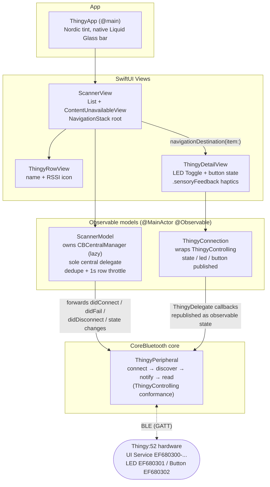
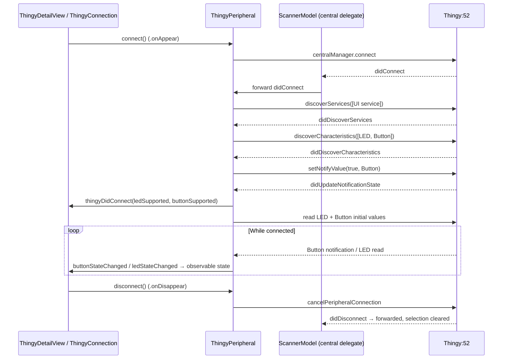

# nRFThingy52

An iOS app for discovering and interacting with a [Nordic Thingy:52](https://www.nordicsemi.com/Products/Development-hardware/Nordic-Thingy-52)
Bluetooth LE development kit. Scan for nearby Thingys, connect, toggle the on-board LED, and watch
the physical button state update live — with haptic feedback on each press.

Built with SwiftUI, the Observation framework, and CoreBluetooth. **No third-party dependencies.**
The original UIKit/storyboard implementation is archived on the `nRFThingy52UIKit` branch.

## Features

- **Scanner** — continuously scans for peripherals advertising the Thingy:52 UI service, listing
  them with live RSSI signal-strength icons (throttled to one refresh per second per device).
- **LED control** — toggle the Thingy's LED from a switch; writes are confirmed by a follow-up
  read so the UI reflects the device's actual state.
- **Button monitoring** — the Thingy's physical button state (PRESSED/RELEASED) streams in via
  BLE notifications, with `.sensoryFeedback` haptics on each press.
- **Localized** into 16 languages; light/dark mode native.

## Requirements

| | |
|---|---|
| iOS deployment target | 17.0 |
| Xcode | any recent (verified with Xcode 26.3) |
| Hardware | a physical Thingy:52 and an iPhone/iPad — the simulator has no Bluetooth radio |
| Dependencies | none (no CocoaPods / Carthage / SPM) |

## Getting Started

```bash
git clone <this-repo>
open nRFThingy52.xcodeproj
```

Select the `nRFThingy52` scheme, pick your device, and Run. On first launch, grant the Bluetooth
permission prompt. With a powered-on Thingy:52 nearby, it appears under "Nearby Devices" —
tap it to connect.

Command-line build and test:

```bash
# Build
xcodebuild -project nRFThingy52.xcodeproj -scheme nRFThingy52 \
  -destination 'platform=iOS Simulator,name=iPhone 15' build

# Run unit tests
xcodebuild -project nRFThingy52.xcodeproj -scheme nRFThingy52 \
  -destination 'platform=iOS Simulator,name=iPhone 15' test
```

## Architecture

SwiftUI views observe `@Observable` models; all CoreBluetooth complexity is concentrated in
`ThingyPeripheral`, with `ScannerModel` as the app-lifetime central-manager owner and
`ThingyConnection` as the per-device observable wrapper.



### Connection lifecycle



Key design points:

- **`ThingyPeripheral`** hard-codes the Thingy:52 User Interface service
  (`EF680300-9B35-4933-9B10-52FFA9740042`) with its LED (`…0301`, write) and Button (`…0302`,
  notify) characteristics. Equality and hash are by `CBPeripheral.identifier`, which the scanner
  uses to dedupe repeat advertisements into live row updates instead of duplicate rows.
- **Single central-manager delegate**: `ScannerModel` owns the `CBCentralManager` (created lazily
  so the permission prompt appears at first scan) and stays its delegate for the app's lifetime,
  forwarding connection events to the selected peripheral. No delegate hand-off races.
- **`ThingyControlling`** is the protocol seam between `ThingyConnection` and `ThingyPeripheral`,
  making the connection state machine unit-testable with a mock (`CBPeripheral` cannot be
  instantiated in tests).
- **iOS 26 note**: the app intentionally uses the native Liquid Glass navigation bar with a
  Nordic-blue tint. An opaque colored bar (the UIKit app's look) obscures SwiftUI's large title
  on iOS 26.
- **Logging** uses `os.Logger` (subsystem = bundle identifier) at debug level — filter in
  Console.app or Xcode's console.

## Project Layout

```
nRFThingy52/
├── ThingyApp.swift                      # @main SwiftUI entry
├── Views/
│   ├── ScannerView.swift                # scan list + empty state
│   ├── ThingyRowView.swift              # name + RSSI icon row
│   └── ThingyDetailView.swift           # LED/button detail screen
├── Models/
│   ├── ThingyPeripheral.swift           # CoreBluetooth state machine + ThingyDelegate
│   ├── ScannerModel.swift               # central manager owner, discovery list, RSSIBucket
│   └── ThingyConnection.swift           # per-device observable state + ThingyControlling
├── Utilities/
│   ├── StringExtension.swift            # .localized helper
│   ├── UIColorExtension.swift           # Nordic palette (UIKit types, unit-tested)
│   ├── ColorExtension.swift             # SwiftUI Color bridge
│   └── <lang>.lproj/Localizable.strings # 16 locales
├── Base.lproj/LaunchScreen.storyboard   # launch screen (storyboards are fine here)
└── Assets.xcassets                      # RSSI icons, app icon, etc.
nRFThingy52Tests/                        # 21 unit tests (utilities + BLE models)
nRFThingy52UITests/                      # UI test target (template)
```

## Testing

21 unit tests: the utility layer (`UIColor` hex parsing/round-trip, dynamic colors,
`String.localized`) and the BLE model layer (`RSSIBucket` boundaries, scanner helpers, and a
mock-driven `ThingyConnection` state-machine suite). Live BLE behavior requires a physical
Thingy:52 — see `nRFThingy52BLEStatus.md` for the fix history and the on-device verification
checklist, and `SwiftUIMigrationPlan.md` for the UIKit → SwiftUI migration record.

## License

No license file is currently included. The app is modeled on Nordic Semiconductor's
[nRF Blinky](https://github.com/NordicSemiconductor/IOS-nRF-Blinky) sample patterns.
