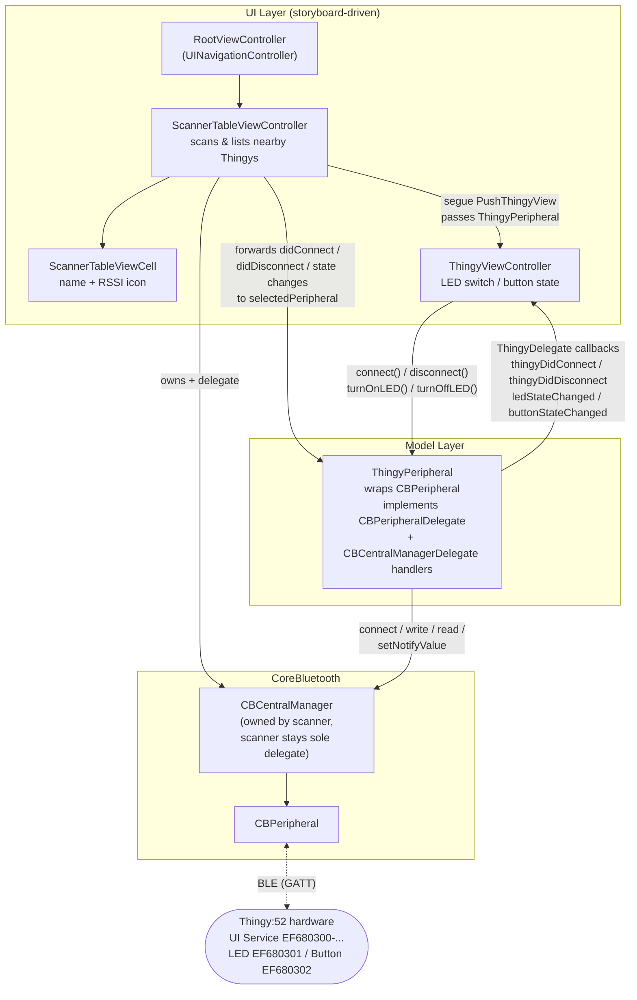
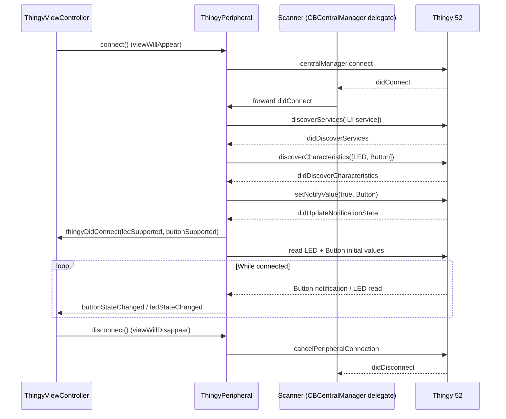

# nRFThingy52

An iOS app for discovering and interacting with a [Nordic Thingy:52](https://www.nordicsemi.com/Products/Development-hardware/Nordic-Thingy-52)
Bluetooth LE development kit. Scan for nearby Thingys, connect, toggle the on-board LED, and watch
the physical button state update live — with haptic feedback on each press.

Built with Swift, UIKit, and CoreBluetooth. **No third-party dependencies.**

## Features

- **Scanner** — continuously scans for peripherals advertising the Thingy:52 UI service, listing
  them with live RSSI signal-strength icons (throttled to one refresh per second per device).
- **LED control** — toggle the Thingy's LED from a switch; writes are confirmed by a follow-up
  read so the UI reflects the device's actual state.
- **Button monitoring** — the Thingy's physical button state (PRESSED/RELEASED) streams in via
  BLE notifications, with `UIImpactFeedbackGenerator` haptics on each change.
- **Localized** into 16 languages.
- Light/dark mode aware, Nordic-branded UI.

## Requirements

| | |
|---|---|
| iOS deployment target | 14.5 |
| Xcode | any recent (verified with Xcode 26.3) |
| Hardware | a physical Thingy:52 and an iPhone/iPad — the simulator has no Bluetooth radio |
| Dependencies | none (no CocoaPods / Carthage / SPM) |

## Getting Started

```bash
git clone <this-repo>
open nRFThingy52.xcodeproj
```

Select the `nRFThingy52` scheme, pick your device, and Run. On first launch, grant the Bluetooth
permission prompt. With a powered-on Thingy:52 nearby, it appears under "Nearby Devices" —
tap it to connect.

Command-line build and test:

```bash
# Build
xcodebuild -project nRFThingy52.xcodeproj -scheme nRFThingy52 \
  -destination 'platform=iOS Simulator,name=iPhone 15' build

# Run unit tests
xcodebuild -project nRFThingy52.xcodeproj -scheme nRFThingy52 \
  -destination 'platform=iOS Simulator,name=iPhone 15' test
```

## Architecture

The app is a two-screen storyboard flow inside a navigation controller. All CoreBluetooth
complexity is concentrated in a single model class, `ThingyPeripheral`, which exposes a simple
four-method delegate protocol to the UI layer.



### Connection lifecycle



Key design points:

- **`ThingyPeripheral`** (`Models/ThingyPeripheral.swift`) hard-codes the Thingy:52 User
  Interface service (`EF680300-9B35-4933-9B10-52FFA9740042`) with its LED (`…0301`, write) and
  Button (`…0302`, notify) characteristics, and drives the full
  connect → discover → subscribe → read pipeline. Peripheral equality is by
  `CBPeripheral.identifier`, which the scanner uses to dedupe repeat advertisements into live
  cell updates instead of duplicate rows.
- **Single central-manager delegate**: the scanner owns the `CBCentralManager` and remains its
  delegate for the app's lifetime, forwarding connection events to the user-selected
  `ThingyPeripheral`. This avoids delegate hand-off races during screen transitions.
- **`ThingyDelegate`** is class-bound with a weak reference, so the view controller ↔ peripheral
  pair cannot form a retain cycle.
- **Logging** uses `os.Logger` (subsystem = bundle identifier, categories `ThingyPeripheral` and
  `Scanner`) at debug level — filter in Console.app or Xcode's console.

## Project Layout

```
nRFThingy52/
├── Models/ThingyPeripheral.swift        # BLE wrapper + ThingyDelegate protocol
├── ViewsControllers/
│   ├── RootViewController.swift         # nav controller, Nordic nav-bar styling
│   ├── Scanner/                         # scan list screen + cell
│   └── ThingyView/                      # LED/button detail screen
├── Utilities/
│   ├── StringExtension.swift            # .localized helper
│   ├── UIColorExtension.swift           # Nordic palette, hex + dynamic colors
│   └── <lang>.lproj/Localizable.strings # 16 locales
├── Base.lproj/Main.storyboard           # both screens + empty-state view
└── Assets.xcassets                      # RSSI icons, app icon, etc.
nRFThingy52Tests/                        # unit tests (color/hex/localization utilities)
nRFThingy52UITests/                      # UI test target (template)
```

## Testing

Unit tests cover the utility layer (`UIColor` hex parsing and round-trip, dynamic light/dark
color resolution, `String.localized` fallback). BLE logic requires a physical Thingy:52 —
see `nRFThingy52BLEStatus.md` for the code-analysis history, the fixes applied, and the
on-device verification checklist.

## License

No license file is currently included. The app is modeled on Nordic Semiconductor's
[nRF Blinky](https://github.com/NordicSemiconductor/IOS-nRF-Blinky) sample patterns.
