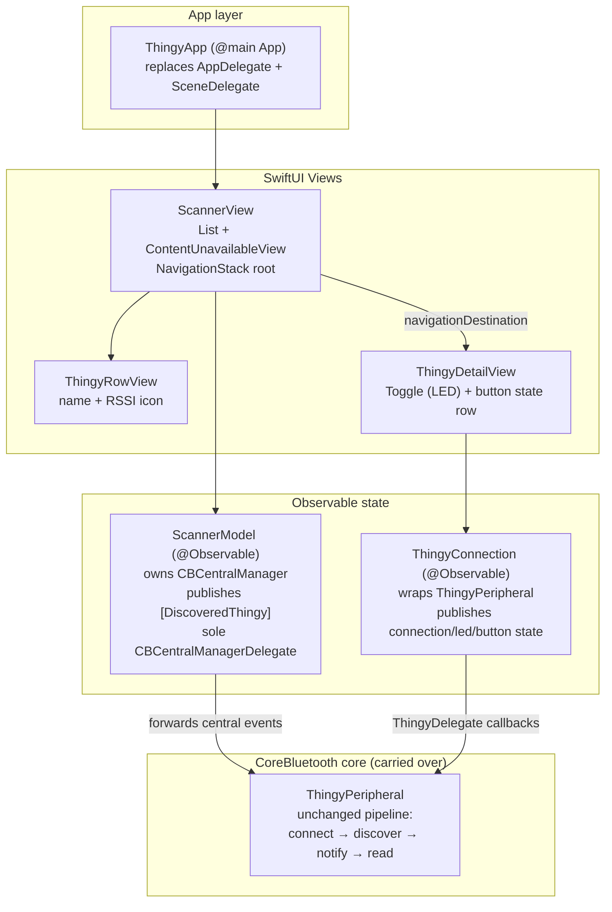

# SwiftUI Migration Plan — nRFThingy52

*Drafted 2026-07-19. UIKit implementation is archived on branch `nRFThingy52UIKit`; all migration
work happens on `main`.*

**Status (2026-07-19): phases 0–5 and 7 complete.** Phase 6 is complete for simulator (light/dark)
and partial on device — the Thingy:52-dependent checklist (`nRFThingy52BLEStatus.md` §9) awaits
hardware. Notable deviation from plan: the Nordic-blue opaque nav bar was dropped in favor of the
native iOS 26 Liquid Glass bar + Nordic tint, because opaque bar backgrounds obscure SwiftUI's
large title on iOS 26 (see status doc §10).

## 1. Goal & Scope

Replace the UIKit/storyboard UI layer with SwiftUI while preserving the app's behavior exactly:
scan → list with live RSSI → connect → LED toggle with read-back → button state with haptics →
clean disconnect on navigate-away. The CoreBluetooth core (`ThingyPeripheral`) carries over with
minimal changes; the UI and app lifecycle are rewritten.

The app is small (2 screens, ~800 lines of UI code), so this is a **full rewrite of the UI layer
in one pass** — not a screen-by-screen `UIHostingController` hybrid. A hybrid would add bridging
code that outlives its usefulness within days.

## 2. Key Decision: Deployment Target

Current target is iOS 14.5, which limits SwiftUI to `NavigationView` and `ObservableObject`.
Raising it unlocks substantially simpler code:

| Target | Unlocks | Cost |
|---|---|---|
| iOS 16 | `NavigationStack`, `navigationDestination` | drops iOS 14/15 devices |
| **iOS 17 (recommended)** | `@Observable` macro, `ContentUnavailableView` (empty state), `.sensoryFeedback` (haptics) | drops iOS 14–16 devices |

**Decision (2026-07-19): iOS 17.** The only registered test device (hardy Pond) runs iOS 18, the
app is not shipped to the App Store, and `@Observable` + `ContentUnavailableView` +
`.sensoryFeedback` directly replace three things we'd otherwise hand-roll. The UIKit archive
branch (`nRFThingy52UIKit`) keeps an iOS 14.5-compatible build available forever.

## 3. Target Architecture

- **`ThingyPeripheral` stays** as the BLE state machine. `ThingyConnection` adopts
  `ThingyDelegate` and republishes callbacks as observable properties
  (`isConnected`, `ledIsOn`, `buttonPressed`, `ledSupported`/`buttonSupported`).
- **`ScannerModel`** absorbs the scanner view controller's non-UI half: owns the
  `CBCentralManager` (created lazily so the permission prompt still fires at first scan),
  remains its sole delegate, dedupes by identifier (the `isEqual`/`hash` work carries over),
  throttles RSSI row updates (~1 s, matching today's cell throttle), and forwards
  connect/fail/disconnect events to the selected peripheral exactly as the UIKit scanner does.
- **Scan lifecycle** moves from `viewDidAppear`/`didSelectRow` to `.onAppear`/`.onDisappear` on
  `ScannerView` (stop scanning when the detail screen pushes, resume on pop — same behavior,
  now automatic).
- **Connect/disconnect lifecycle** moves from `viewWillAppear`/`viewWillDisappear` to
  `.onAppear`/`.onDisappear` on `ThingyDetailView`.

## 4. File-by-File Mapping

| UIKit (archived) | SwiftUI (new) | Notes |
|---|---|---|
| `AppDelegate` + `SceneDelegate` | `ThingyApp.swift` (`@main`) | nothing else lives in either today |
| `Main.storyboard` (both scenes + empty view) | `ScannerView`, `ThingyRowView`, `ThingyDetailView` | delete storyboard; remove `UIMainStoryboardFile`/scene manifest from `Info.plist` |
| `RootViewController` (nav bar styling) | `.toolbarBackground(.nordicBlue)` / tint modifiers | iOS 26 Liquid Glass handling becomes free — delete `hidesSharedBackground` workaround |
| `ScannerTableViewController` | `ScannerView` + `ScannerModel` | scanning-spinner becomes a `ProgressView` in the toolbar, shown while scanning |
| `ScannerTableViewCell` | `ThingyRowView` | RSSI bucket logic moves to a testable `RSSIBucket` enum |
| empty-state view (storyboard) | `ContentUnavailableView` (or small custom view) | replaces the manual add/remove-subview + rotation code entirely |
| `ThingyViewController` | `ThingyDetailView` + `ThingyConnection` | `Toggle` bound to model; haptics via `.sensoryFeedback(.impact, trigger: buttonPressed)` |
| `ThingyPeripheral` | **kept** | only change: delegate callbacks hop to `@MainActor` in `ThingyConnection` (replaces the scattered `DispatchQueue.main.async`) |
| `StringExtension` | kept (model-side strings); views use `Text("KEY")` auto-localization | `Localizable.strings` files unchanged |
| `UIColorExtension` | add a thin `Color` bridge (`Color.nordicBlue`, …) | keep `UIColor` versions — unit tests cover them |
| `LaunchScreen.storyboard` | kept | launch screens may remain storyboard-based |

## 5. Phases

Each phase leaves `main` building and the app functional.

- **Phase 0 — prep** *(this document)*: confirm deployment-target decision; verify the
  `nRFThingy52UIKit` archive branch builds.
- **Phase 1 — observable core**: add `ScannerModel` and `ThingyConnection` alongside the
  existing UIKit code (no UI changes yet). Pure addition; UIKit still drives the app.
- **Phase 2 — SwiftUI entry + scanner**: replace app lifecycle with `ThingyApp`, build
  `ScannerView`/`ThingyRowView` on `ScannerModel`, `NavigationStack` root. Detail screen
  temporarily reached via a `UIViewControllerRepresentable` shim **or** phases 2–3 land
  together (preferred given the app's size).
- **Phase 3 — detail screen**: `ThingyDetailView` on `ThingyConnection`; LED toggle, button
  row, disconnected-state styling (red tint on disconnect, matching UIKit behavior).
- **Phase 4 — deletion pass**: remove storyboard, all `UIViewController` subclasses, the
  scene manifest, and the iOS 26 nav-bar workaround. Update `Info.plist`.
- **Phase 5 — tests**: keep the 6 utility tests; add `ScannerModel` dedupe/throttle tests and
  `ThingyConnection` state-mapping tests (the delegate seam makes these mockable without
  CoreBluetooth for the first time).
- **Phase 6 — verification**: simulator UI pass (empty state, dark mode, dynamic type), then
  the full on-device checklist from `nRFThingy52BLEStatus.md` §9 on hardy Pond — items 1–7
  all re-apply to the SwiftUI build, plus permission-prompt timing (first scan tap).
- **Phase 7 — docs**: update `README.md` architecture diagrams, `CLAUDE.md`, and record the
  migration + test results in `nRFThingy52BLEStatus.md`.

## 6. Risks & Watch Items

1. **Permission-prompt timing** — creating `CBCentralManager` at model `init` vs first scan
   changes when the Bluetooth prompt appears. Create it lazily on first scan request to keep
   today's behavior (prompt at launch of the scanner screen).
2. **`.onDisappear` ordering** — unlike `viewWillDisappear`, it fires *after* the transition;
   the disconnect will land a beat later than in UIKit. Acceptable, but verify the
   back-then-quickly-reselect flow (checklist item 5) doesn't race the reconnect.
3. **Main-actor discipline** — CoreBluetooth delivers on the main queue today (`queue: nil`),
   but the SwiftUI models should be `@MainActor` so this is enforced by the compiler rather
   than by convention.
4. **Live RSSI updates in `List`** — per-advertisement updates must not re-render the whole
   list; keep rows `Identifiable` by peripheral identifier and throttle per-row updates as the
   cell does today.
5. **Localization** — SwiftUI `Text` uses the same `Localizable.strings` keys, but verify the
   16 locales still resolve (keys are currently English-sentence style, which `Text` handles).
6. **Storyboard deletion is the point of no return** — do it only after Phase 3 is verified on
   the simulator; the archive branch is the rollback path regardless.

## 7. Definition of Done

- No UIKit view controllers or storyboards remain (except `LaunchScreen.storyboard`).
- All items in `nRFThingy52BLEStatus.md` §9 pass on hardy Pond with the SwiftUI build
  (hardware checklist still gated on a physical Thingy:52).
- Unit tests ≥ current 6, including new model tests; all green.
- README/CLAUDE.md reflect the SwiftUI architecture.
